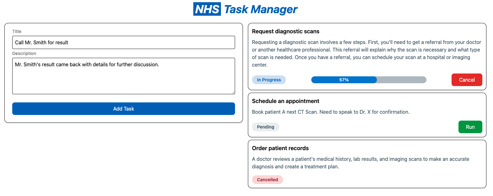

# NHS Task Manager

A small web app to manage and run “tasks". These tasks simulate long-running
actions that users can start or cancel.



## Requirements

1. Task Creation & Management

    * Create a simple form to define and add a new task (e.g., task title and
description)
    * Maintain tasks in a local data structure
    * Display the list of tasks on the UI
2. Task Operations
    * Provide a button to "Run" each task, updating its status to "In Progress."
    * Add a "Cancel" button for each task to simulate stopping a long-running operation
    * Assume endpoints like POST /runTask/:id and POST /cancelTask/:id (mock these)
3. Task Status
    * Update and display the status of each task (e.g., "Pending," "In Progress," "Completed", "Cancelled")
    * Optionally, add a progress indicator for running tasks
4. Accessibility
    * Ensure all UI elements are accessible
    * Design with clarity for NHS staff in mind (e.g., avoid clutter and ensure a clean, intuitive layout)

## Installation

Install dependencies at root level `package.json`

```bash
 npm install
```

## Usage

To execute the commands for the whole project execute at root level `package.json`, else you can execute at desired workspace.

1. To run the project, use the following command:

```bash
npm run start
```

2. To lint the project with eslint, use the following command:

```bash
npm run lint
```

3. To format the project with prettier, use the following command:

```bash
npm run format
```

4. To build the project, use the following command:

```bash
npm run build
```

5. To test the project with vitest, use the following command:

```bash
npm run test
```

## Technology Decisions

- **React.js** for reactive interactions and renders on the frontend. This is also my most recent knowledgeable library compared to Angular and Vue.
- **Tailwind** since there were no need for complicated component libraries I decided to use Tailwind for ease of styling. Tailwind is also my recent go-to CSS framework as it provides full control of CSS to Engineers without the heavy burden of syntax memorisation.
- **Vite** I chose to use Vite as the build tool as it provides a fast start and perfect for small projects. The generation tool cater to specific project needs so it does not by default pull down many dependencies.
- **Axios** was used, instead of creating a Node.js Express backend to backend the endpoints I've decided to use a combination of Axios and Axios Mock Adapter where endpoints are intercepted and mocked (*this can be found in api.ts*).

## Design Decisions

- The NHS blue was used as the primary colour and the rest of the colour scheme can be found on [NHS's official guideline](https://www.england.nhs.uk/nhsidentity/identity-guidelines/colours/).
- UI Components are simple, easy to use and fully tabbed index, so user can navigate easily with the keyboard. When focused (via the keyboard) on the button it will highlight the button differently to mark the user's current position. 
- The plugin `eslint-plugin-jsx-a11y` was used to help lint the project and spot any accessibility issues. 
